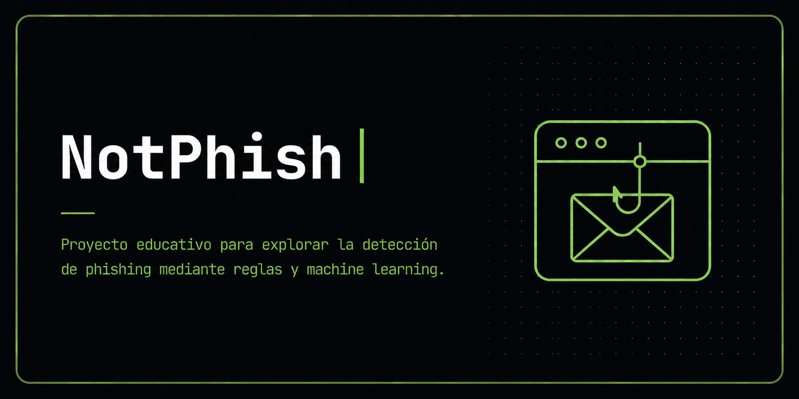

<p align="center">
  
</p>

# NotPhish

Educational cybersecurity project focused on understanding phishing detection through rule-based analysis and machine learning.

## Overview

NotPhish is a phishing detection prototype that analyzes message content using multiple layers:

- JavaScript rules
- machine learning model
- hybrid system that combines both results

The project began as a continuation of Social Engineering Scanner, where I explored the limitations of detecting suspicious messages using only rules and keywords.

It is not a production-ready tool. It is an educational project created to better understand how these approaches work, where they fail, and why detecting real phishing is more difficult than it seems.

## Goal

With this project I wanted to understand:

- why simple rules are not enough to detect phishing
- how a multi-layer detection system works
- what a machine learning model does when applied to text
- how TF-IDF converts text into numerical data
- what challenges appear when combining rules with machine learning
- what limitations still exist in a more complex system

## Main Features

- rule-based detection
- suspicious URL analysis
- social engineering signal detection
- OTP code theft attempt detection
- machine learning model for text classification
- hybrid system combining rules and machine learning
- web interface with simple explanations for the user
- technical log showing which signals triggered the analysis

## How It Works

NotPhish analyzes a message using three main layers.

### Layer 1: JavaScript Rules

The first layer checks for specific signals within the text.

It detects elements such as:

- domains that imitate well-known brands
- shortened or unusual URLs
- OTP code requests
- urgency
- authority
- isolation
- promises of reward
- common social engineering patterns

Each signal has a weight. Some signals are weak and only contribute to the overall score. Others are stronger and can trigger more direct alerts.

This layer is easy to understand and review, but it has an important limitation: it does not truly understand context. A legitimate message may trigger suspicious rules, while a fraudulent message may avoid the expected keywords.

### Layer 2: Machine Learning Model

The second layer uses a model trained on approximately 46,000 texts collected from public datasets related to phishing, scams, newsletters, and legitimate emails.

For this project, I searched for and reviewed datasets that allowed comparisons between fraudulent and legitimate messages. The goal was not to build a perfect model, but to understand how a classifier behaves when learning patterns from many real examples.

The model used is SGD (Stochastic Gradient Descent). It is not a neural network or an LLM. It is a linear model that learns patterns from examples.

Before classifying the text, the system converts it into numerical features using TF-IDF.

TF-IDF helps represent which words are important within a message:

- TF measures how frequently a word appears in the text
- IDF reduces the weight of overly common words
- more distinctive words receive greater importance

The model also analyzes combinations of words and character variations. This helps detect expressions that may carry more meaning together than individually.

The model was trained primarily on English texts, so its performance on Latin American Spanish is more limited.

### Layer 3: Hybrid System

The third layer combines the output of the rule-based system with the output of the machine learning model.

The challenge is that both layers do not always agree. The rules may classify a message as safe while the model considers it suspicious. The opposite can also happen.

To manage this difference, the system uses an `evidence gate`. This logic determines how much influence the model should have based on the available evidence.

The goal is to prevent the model from changing the result too much when the text is short, ambiguous, or lacks sufficient technical signals.

This system does not eliminate errors. It simply attempts to make the combination of rules and machine learning more controlled.

## Installation and Usage

Clone the repository:

```bash
git clone https://github.com/fabianubilla/notphish.git
cd notphish
```

On macOS:

```bash
pip3 install scikit-learn joblib flask
python3 server.py
```

On Linux:

```bash
pip install scikit-learn joblib flask
python server.py
```

Then open `index.html` in your browser.

You can also open `index.html` directly without running Python. In that case, only the JavaScript rule-based layer will work, without machine learning.

## Project Structure

```text
notphish/
├── index.html
├── app.js
├── hybrid.js
├── hints.js
├── server.py
├── config.json
└── models/
    ├── primary_model_candidate.joblib
    └── subcategory_model_candidate.joblib
```

## Main Files

### `index.html`

Project web interface.

### `app.js`

JavaScript rule engine.

### `hybrid.js`

Hybrid system combining rules and machine learning.

### `hints.js`

Explanatory texts displayed to the user.

### `server.py`

Flask server that loads the model and responds to frontend requests.

### `config.json`

Parameters, thresholds, and weights used by the system.

### `models/`

Trained models used by the machine learning layer.

## Limitations

- Not a production-ready tool
- The model was trained primarily on English texts
- Performance on Latin American Spanish is more limited
- May generate false positives
- May fail with very short or ambiguous messages
- Does not analyze email headers
- Does not detect image-based or QR code phishing
- Does not operate in real time
- Requires manually pasting the text to analyze
- The rules can be bypassed if someone knows how they work

## What I Learned

This project helped me understand that adding machine learning does not automatically turn a detector into a reliable tool.

Rules are easy to review, but they do not understand context. The model can identify broader patterns, but it can also make mistakes, especially with ambiguous texts or languages different from those used during training.

The most interesting part was realizing that the challenge was not only detecting more signals. It was also deciding what to do when the different layers of the system disagreed.

NotPhish helped me better understand concepts such as TF-IDF, text classification, false positives, hybrid scoring, and practical limitations in phishing detection.

## Next Step

This project mainly analyzes the content of a message.

A future layer would analyze email headers, where technical indicators related to the domain, message routing, and authentication mechanisms such as SPF, DKIM, and DMARC can be found.

## Technologies

HTML · CSS · JavaScript · Python · Flask · scikit-learn · TF-IDF · SGD

## AI-Assisted Development

This project was developed with significant support from Claude by Anthropic, particularly in code writing, technical structure, and several implementation decisions.

I do not present this repository as a tool built entirely by hand. I share it as an educational project and as part of my real learning process in cybersecurity and computer science.

My role was to define what I wanted to explore, guide the project's direction, test the system, review its results, identify errors, refine ideas, discard approaches that did not make sense, and progressively understand how its different layers were connected: rules, the machine learning model, and the hybrid system.

Working on this project helped me learn more than simply reading theory because I was able to experiment with a real tool, observe where it failed, and better understand the limitations of phishing detection.

## License

MIT
